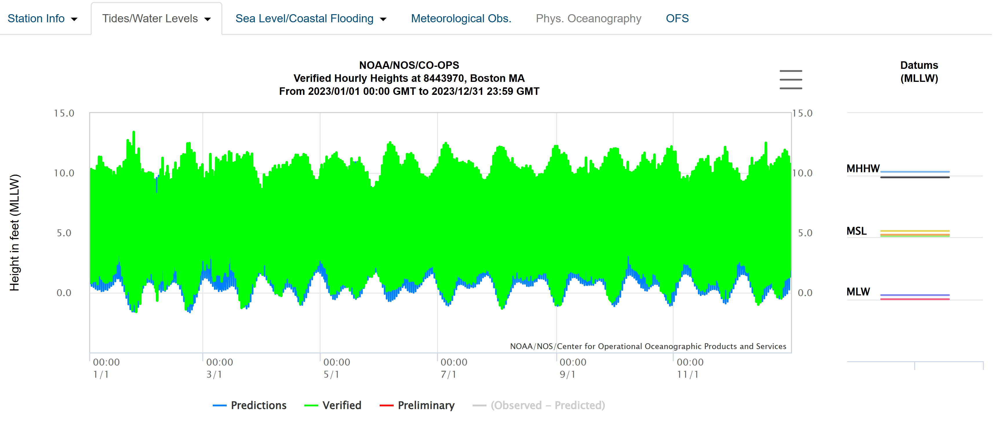
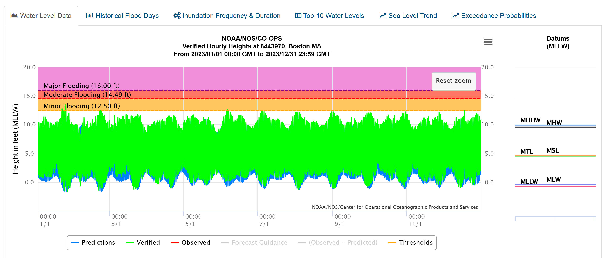
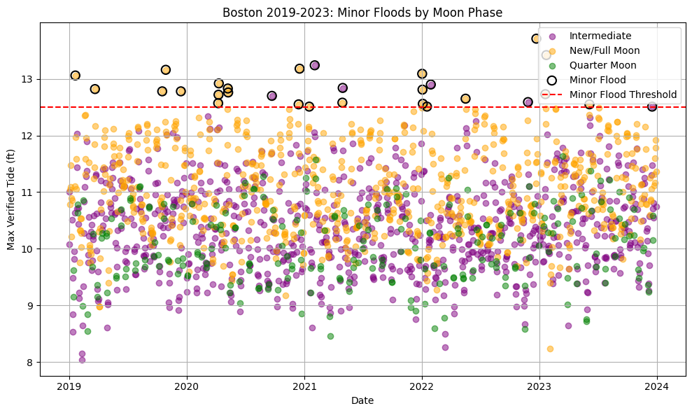
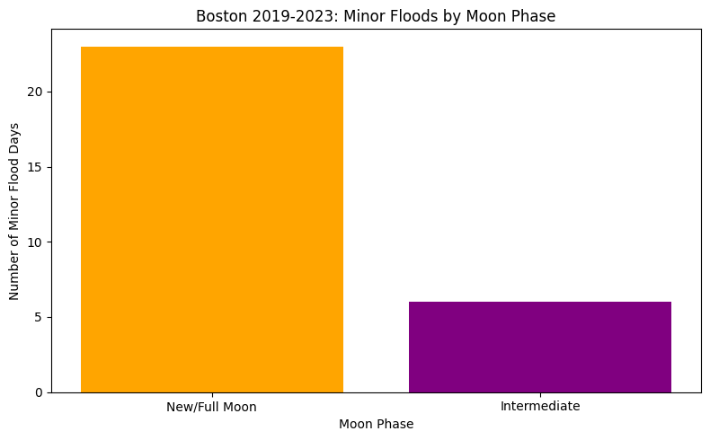
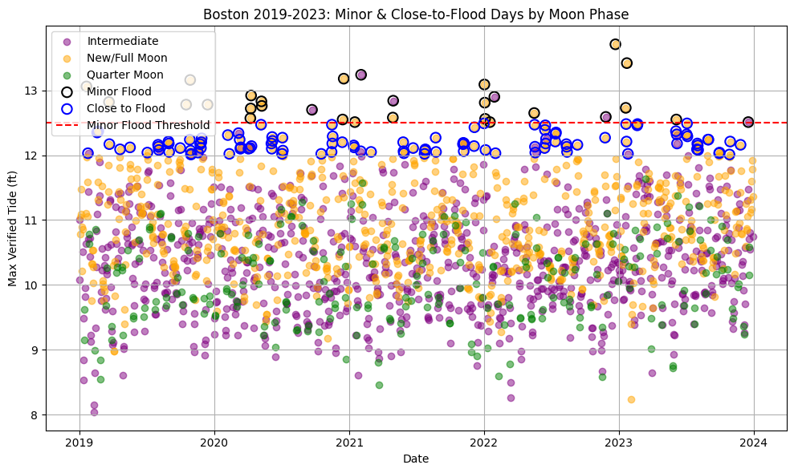
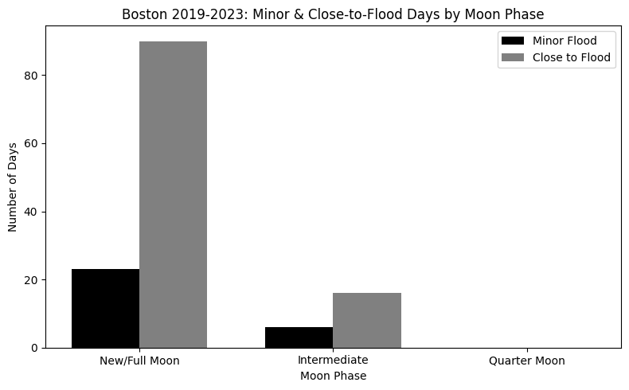
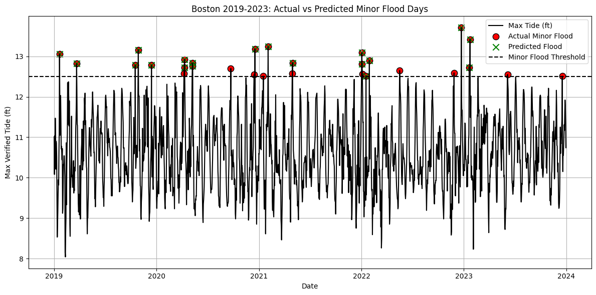

# CS506 Final Project

This project will explore the effects of weather conditions and lunar phases on tides in the United States for the purposes of predicting the existence of flooding.  

It is known that the Moon's phases cause a variation in the tidal range based on the alignment between itself, the Earth and the Sun. On new and full moons, we see more extreme tides as the Earth is in almost perfect alignment with the Sun and Moon, while tides tend to mellow during phases where we see perpendicular alignment that exerts lesser gravitational forces on the tides of the Earth. However, this alone does not directly influence flooding. The weather on Earth also has to play its part, creating a perfect storm for flooding in a U.S. city.

In order to execute this project, we can take daily publicly available weather data from two cities in the United States and their respective National Oceanic and Atmosphere Administration (NOAA) tide data across a span of approximately 5 years. NOAA tide gauges publish their flood stage thresholds for a given day, with by-the-hour precision. These thresholds are used to define minor, moderate, and major flooding in a city. For this project, a "flood" is an instance where the observed water level is higher than the minor flood threshold in a city, as even minor flooding results in damage and risk to human life. In the event that we see consistent flooding instances, we can instead compare our tide heights to the moderate threshold. These thresholds ensure that flooding instances are properly documented per city and not generalized. We will also calculate the lunar phases based on the data in order to see the effect of parallel alignment phases. Full moons are documented on sites that publicly display weather data, with predictable phase prediction.

For the purposes of this project, we will choose two cities: one in the east coast and one in the west coast. Coastal cities will be impacted by lunar phases more strongly. The cities will be:

Boston, Massachusetts  
Miami, Florida  

If possible, an additional two cities will be studied:  
Seattle, Washington  
Los Angeles, California     

This raw data will be put into one dataset to analyze any patterns when it comes to flooding frequency. These trends can be visualized via a histogram of flood frequency by moon phase and a scatter plot comparing weather conditions on days where there was flooding and days where there wasn't flooding. We can then use 80% of the data to train a classification model to estimate flood risk on a given day, likely using XGBoost to predict a binary outcome of a flood day or not a flood day. We can then test this on the remaining 20% of the dataset to evaluate its performance. Performance can be evaluated by a mixture of precision and recall. Recall will help measure how well we identify actual flood days and precision will show how often those predictions are correct.

Midterm Report

Data Collection

Data collection was a relatively straightforward task. The NOAA provides publicly accessible water level data for cities in the United States. For cities like Boston, there is no strict daily tide data, but there is hourly tide data that can be collected per year. This gives us the option of having hourly data per day, or calculating the mean tide height per day. We will use the latter to present these preliminary results.

Next up was the process of gauging what we consider a flood instance. We can do this by getting the flood thresholds based on the MLLW (Mean Lower Low Water) datum, which gives us a conservative baseline for water depth. This was also the datum we used for the data before. We will use the minor flooding threshold for this.

This provides us with the same data from before but compared to the NOAA thresholds for Minor, Moderate, and Major flooding. From this alone, we can see some of the correlations we will see in our final results, even if they are not yet obvious. 

Data Processing

We will use pandas to operate on the csv file of the raw data. The NOAA files comes with the following headers:

        Date Time (GMT)  Predicted (ft) Preliminary (ft)  Verified (ft)  
    0  2023/01/01      00:00           8.684                -           9.19  
    1  2023/01/01      01:00           7.574                -           8.16  
    2  2023/01/01      02:00           5.846                -           6.45  
    3  2023/01/01      03:00           3.745                -           4.48  
    4  2023/01/01      04:00           1.793                -           2.56  

We will use the verified tide height for the purposes of this experiment, since this is the tide height we know happened. We will calculate the mean of the hourly data to create daily tide means as follows:

	Predicted_mean	Verified_mean	Verified_max	Verified_min  
Datetime				
2023-01-01	4.872958	5.464583	10.32	0.83  
2023-01-02	4.925042	5.384583	10.22	0.97  
2023-01-03	4.993417	5.487917	10.17	1.00  
2023-01-04	5.060500	5.751667	10.58	0.72  
2023-01-05	5.110250	6.272917	11.35	1.4  

The Verified_max will give us the max tide per day, which we will use to indicate flooding because at some point in a given day, the max tide reached flood conditions. From our thresholds, we see that a minor flood occurs when the tide goes above 12.5ft. This value remains unchanged as NOAA thresholds are based on historical data per station, so 12.5ft is already an estimate for minor flooding based on historical results.

The next step is to introduce our independent variable, and we can do that with the PyEphem astronomy library. Rather than ripping moon phase data from the internet, we can define a function that takes the moon phase for every timestamp we have. If the moon is less than 10% or more than 90% visible, it is a new/full moon which means we have a parallel alignment phase. If it is below 40% or above 60% visible, we have a quarter moon phase and anything else is an intermediate phase.

Introducing Weather Data

We mentioned introducing weather data as a way to see what combination of elements creates a flood instance besides just moon phase. This has proven to be a lot less intuitive than expected, as it introduces additional variables that could affect tides. Predominantly, those are high wind speeds and heavy rainfall, which are indicators of low-pressure systems on Earth. In order to add this data to our current scheme, we would need to average those values on a per-day basis. Alternatively, reverting our raw data to an hourly basis which would exponentially increase the number of data points and also create instances where the same calendar day can both have and not have a flooding instance. For now, they will be omitted. 

Plotted below is the 2019-2023 results of minor flooding by moon phase. We have a dot plot that shows every day across the 5 years and what phase of the moon they were at along with their max verified tide average. From the dot plot, we can see some correlations. It is far more likely for a quarter moon (or a neap tide phase) to have lower tides on average. Intermediate phases, as their name suggests, also populate the middle and upper half of the plot. We can also see that parallel alignment phases present higher tides on average and are more likely to break the threshold of minor flooding.

Isolating the data to only the days where we broke the threshold, we can create a bar graph that separates the days by moon phase. From it, we can see that the vast majority of floods in Boston were during parallel alignment phases, with some intermediate phase floods as well. This aligns with what we would expect.

This creates good news and bad news. We see a tendency for flooding in parallel alignment phases (new and full moons). However, we also notice that there are very few actual instances of flood days in 5 years. This is only data for one city, but it creates a precedent of flood conditions being very uncommon that will likely carry over to other cities. We could address this in two ways. One way would be to introduce more cities, such as the four we had planned before to get more instances of actual floods. Another way to address this is to create a new category: days where the max tide is within ½ ft of the minor flooding line which give us “flood watch” conditions. Given that flood conditions can happen in short bursts of time, this could be a way to account for days where flood conditions can present themselves but not for a long period of time per day.

Pursuing the latter option, we can create a buffer of 0.5ft that will be used to highlight data values that are below the NOAA minor flooding threshold but that are not above it. Plotting this in our already existing plot, we get this:

This does increase the number of data points, and provides a good option in case flooding is a very uncommon occurrence throughout all of our city datasets. The next step would be to replicate this procedure for the other cities. Given that they would likely have different NOAA flood thresholds, it does not make sense to put them into one single dataset.

Preliminary Data Modeling

Training this dataset for f1-score, precision, and recall using LogisticRegression, we can see that we do a relatively good job at precision, but recall and f1-score is where we see disparity when it comes to confirming that we have a flood day. We are still relatively accurate, with an 89% f1-score and an 80% recall. This shows that, for now, we are able to pretty accurately note when a day is NOT a flood day, but noting when we DO have a flood day will require additional sampling, perhaps other weather-related variables, and a more robust model to train.

